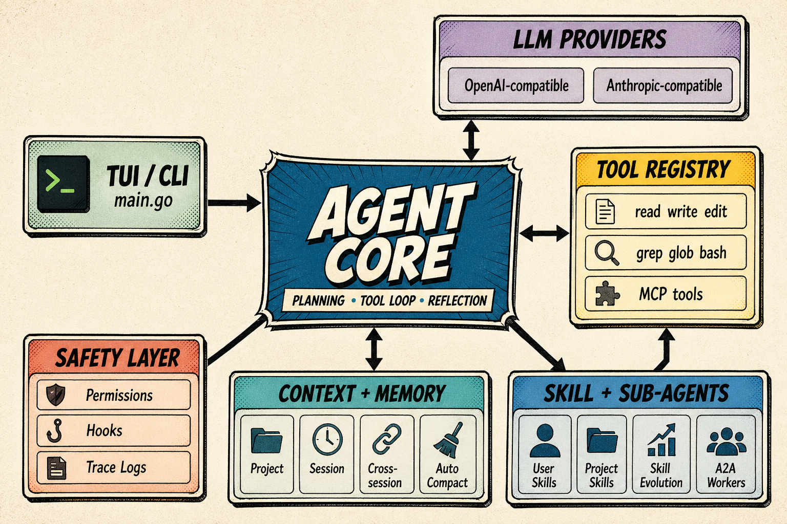

# CodingMan

CodingMan 是一个用 Go 实现的 coding agent。它以 TUI 作为默认入口，围绕 Agent Core 提供模型调用、工具执行、权限控制、上下文管理、会话恢复、SKILL、MCP、Hooks 和多 Agent 协作能力。

启动 CodingMan 的目录会作为默认工作目录。程序启动时优先从项目根目录的 `.env` 加载配置；如果没有 `.env`，则读取当前环境变量。配置了 `BASE_URL` 时，表示使用第三方 OpenAI-compatible 或 Anthropic-compatible endpoint。



## 快速开始

准备配置：

```bash
cp .env.example .env
```

编辑 `.env`，至少填写：

```env
PROVIDER=OpenAI
MODEL_NAME=gpt-5-mini
API_KEY=
BASE_URL=
```

启动 TUI：

```bash
go run .
```

安装全局命令：

```bash
make install
```

安装后可在任意目录使用 `CM` 启动 CodingMan。默认会把可执行文件安装到 `/usr/local/bin/CM`，并把运行所需文件同步到 `~/.codingman/app`。如果没有 `/usr/local/bin` 写权限，可以指定用户目录：

```bash
make install PREFIX=$HOME/.local
```

启动时配置加载顺序为：当前项目 `.env`、`~/.codingman/.env`、环境变量。安装时如果当前源码目录存在 `.env` 且用户级配置不存在，会自动初始化 `~/.codingman/.env`。

卸载全局命令、应用文件和所有用户数据：

```bash
make uninstall
```

该命令会删除 `CM`、`~/.codingman/app` 和整个 `~/.codingman` 目录。

常用验证：

```bash
go test ./...
go build ./...
go vet ./...
```

## 核心能力

- **TUI 入口**：`main.go` 是启动入口，支持普通对话、plan mode、ESC 中断、图片输入和 slash commands。
- **Provider**：支持 OpenAI-compatible 和 Anthropic-compatible 模型接口；第三方 API 通过 `BASE_URL` 接入。
- **工具系统**：内置 `read`、`write`、`edit`、`grep`、`glob`、`bash`、`websearch`，并支持并行安全分批执行；`write` / `edit` 成功后会在 TUI 中显示文件 diff。
- **权限系统**：支持 `ask`、`allow-deny`、`full-auto` 三种模式；只读工具和安全 bash 命令可默认并行。
- **macOS 沙箱**：`ask` 模式下可通过 Apple VF / vfkit 启动 Debian 12 slim VM，将 `bash`、写入、curl、Python/Node 脚本执行路由到 VM 内 MCP Server。
- **上下文系统**：加载系统提示词、项目记忆、SKILL、会话记忆、跨会话记忆，并支持自动压缩。
- **SKILL 系统**：支持用户级和项目级 SKILL，项目级同名覆盖用户级；每次真实执行前会用 LLM 从用户级 SKILL 中自动选择可用 SKILL，也可通过 `/skill use <name>` 手动激活运行时工具白名单。
- **记忆自我进化**：复杂任务后自动审查对话，将可复用经验沉淀为用户级 SKILL；Agent 自沉淀的低频旧 SKILL 会按保守 LRU 策略淘汰。
- **MCP Client**：支持 stdio、SSE、HTTP、WebSocket 传输，提供 MCP tools 和 resources 访问。
- **Hooks**：支持 `http`、`shell`、`function`、`log` 类型 Hook，覆盖工具调用和 Agent 生命周期事件。
- **子 Agent / A2A**：主 Agent ID 默认为 `main`，可启动直接子 Agent，支持 fork/worker 模式、异步任务和中止。
- **日志系统**：每轮对话生成 trace id，日志格式为 `[时间][trace id] 内容`。

## 配置

主要配置来自 `.env`：

```env
PROVIDER=OpenAI
MODEL_NAME=gpt-5-mini
API_KEY=
BASE_URL=

CWD=.
BASE_SYSTEM=
INCLUDE_DATE=true
LOAD_AGENTS_MD=true
LOAD_SKILLS=true
AUTO_COMPACT=true
COMPACT_THRESHOLD=60000
KEEP_RECENT_ROUNDS=6
MAX_AGENTS_MD_BYTES=65536
PROGRESSIVE_MEMORY_MAX_CHARS=12000
PROGRESSIVE_SKILL_MAX_CHARS=12000

MAX_LLM_TURNS=20
MAX_TOOL_CALLS=50
MAX_PARALLEL_TOOL_CALLS=4
MAX_CONSECUTIVE_TOOL_ERRORS=3
MAX_CONSECUTIVE_API_ERRORS=3
MAX_SUB_AGENT_DEPTH=1
MAX_CONCURRENT_SUB_AGENTS=4

SESSION_MEMORY_TOOL_THRESHOLD=10
SKILL_EVOLUTION_TOOL_THRESHOLD=10
SKILL_EVICTION_ENABLED=true
SKILL_EVICTION_UNUSED_DAYS=90
SKILL_EVICTION_MIN_USES=3
SKILL_EVICTION_CHECK_INTERVAL_HOURS=24
SESSION_MEMORY_MAX_ENTRIES=8
SESSION_MEMORY_MAX_CHARS=8000
CROSS_SESSION_MEMORY_MAX_CHARS=12000
```

提示缓存、工具预算、重试、日志等配置见 [.env.example](.env.example)。

## Slash Commands

TUI 内输入 `/help` 可以查看所有命令。

常用命令：

```text
/help                         show help
/clear                        clear conversation history
/cache                        show prompt cache status
/cache on|off                 enable or disable prompt cache
/plan                         show plan mode status
/plan on|off                  toggle plan mode
/skill                        show loaded and active skills
/skill use <name>             activate a skill and its allow_tools
/skill clear                  clear active skill
/sessions                     list saved sessions
/resume [session_id|latest]   restore a saved session
/system <path>                load system prompt from file
/permission                   show permission mode and policy
/permission ask               ask before tool calls
/permission allow-deny        use allow/deny policy
/permission full-auto         allow all tool calls
/allow <tool>                 allow a tool in this session
/allow *                      allow all tools in this session
/deny <tool>                  deny a tool in this session
/exit                         quit
```

## 上下文与记忆

项目记忆按用户级、项目级、本地级渐进加载：

- 用户级：`~/.codingman/AGENTS.md`
- 项目级：`<project>/.codingman/AGENTS.md`
- 项目规则：`<project>/.codingman/rules/**/*.md`
- 本地级：从项目根目录到当前工作目录逐级加载 `.codingman/AGENTS.md`

会话以启动目录为粒度持久化：

```text
~/.codingman/projects/<path-hash>/
```

每个会话独立 JSONL 文件，恢复范围包括 messages、file history、attribution、todos 和 session memory。

跨会话记忆存储在：

```text
~/.codingman/projects/<path-hash>/memory/
```

包含：

```text
MEMORY.md
user_prefs.md
project_stack.md
feedback_testing.md
references.md
```

## SKILL

用户级 SKILL：

```text
~/.codingman/skills/<skill-name>/SKILL.md
```

项目级 SKILL：

```text
<project-root>/.codingman/skills/<skill-name>/SKILL.md
```

SKILL frontmatter 示例：

```md
---
name: go-testing
description: Go test debugging workflow
allow_tools: [read, grep, bash, edit]
context: fork
codingman_generated: false
created_at: 2026-04-29T00:00:00Z
updated_at: 2026-04-29T00:00:00Z
---

# Go Testing

Describe the reusable workflow here.
```

字段说明：

- `name`：SKILL 名称。
- `description`：一句话描述。
- `allow_tools`：激活该 SKILL 后 Agent 可用工具白名单；不写表示所有工具。
- `context`：`fork` 或 `inline`，默认 `fork`。
- `codingman_generated`：是否由 Agent 自我沉淀生成。未写或为 `false` 时视为用户主动添加，不会被自动淘汰。
- `created_at` / `updated_at`：可选时间戳，用于自沉淀 SKILL 的保守淘汰判断。

真实执行进入 `RunToolLoop` 前，Agent 会扫描用户级 SKILL，并让当前 LLM 按任务内容选择最多一个相关 SKILL。自动选中的 SKILL 会完整注入当前轮 system prompt 的 `## Active Skill`，TUI 会显示：

```text
using skill: go-testing - Go test debugging workflow
```

如果已经通过 `/skill use <name>` 手动激活 SKILL，则手动选择优先，自动选择不会覆盖。

当工具调用次数达到 `SKILL_EVOLUTION_TOOL_THRESHOLD` 后，Agent 会在后台审查对话，将值得长期复用的经验写成用户级 SKILL。

自沉淀 SKILL 会写入 `codingman_generated: true`，并在以下文件记录使用次数和最近使用时间：

```text
~/.codingman/skills/.codingman_usage.json
```

默认淘汰策略只处理 `codingman_generated: true` 的用户级 SKILL：超过 90 天未使用且累计使用少于 3 次才会删除；项目级 SKILL、用户手动添加的 SKILL、未标记的历史 SKILL 都不会被淘汰。

## 文件 Diff

`write` 和 `edit` 工具成功修改文件后，TUI 会立即显示简洁 unified diff：

```diff
--- path/to/file.go
+++ path/to/file.go
-old line
+new line
```

失败的工具调用不会显示 diff。该能力用于让用户在 agent loop 中直接看到增删改，不改变工具返回给模型的内容。

## macOS 沙箱

沙箱暂时只支持 macOS arm64 + Apple Virtualization Framework / vfkit，不依赖 Docker。默认 `SANDBOX_ENABLED=auto`，在 `permission=ask` 模式下启用；`full-auto` 不启动沙箱，并会提示本地执行风险。

首次启动会创建 `~/.codingman/sandbox/config`，并在 TUI 中检查 vfkit、Debian 12 slim 镜像、VM MCP Server 等依赖。缺少依赖时会询问是否安装，并显示配置进度；从 `full-auto` 切回 `/permission ask` 时也会重新检查沙箱环境。

`ask` 模式下，bash 写入/变更类命令、`write`、`edit`、危险 `curl`、直接执行 Python/Node 脚本等操作会进入 Debian 12 slim VM 执行。只读 `read` / `grep` / `glob` / `websearch` 默认仍走本地。启动 CodingMan 的目录会挂载到 VM，并提供 `/workspace` 路径。

常用配置：

```text
~/.codingman/sandbox/config
~/.codingman/sandbox/debian-12-slim-arm64.raw
```

```env
SANDBOX_ENABLED=auto
SANDBOX_VFKIT=vfkit
SANDBOX_KEEPALIVE_INTERVAL=30s
SANDBOX_ROOTFS_SOURCE=/path/to/pre-downloaded/debian-12-genericcloud-arm64.raw
DEBIAN_IMAGE_URLS=https://cloud.debian.org/images/cloud/bookworm/latest/debian-12-genericcloud-arm64.raw|https://chuangtzu.ftp.acc.umu.se/images/cloud/bookworm/latest/debian-12-genericcloud-arm64.raw
```

镜像下载会自动尝试多个 Debian 源；网络不稳定时，可以先手动下载 `debian-12-genericcloud-arm64.raw`，再通过 `SANDBOX_ROOTFS_SOURCE` 指向本地文件。

## MCP 与 Hooks

MCP 配置从以下文件合并加载：

```text
~/.codingman/settings.json
<project-root>/settings.json
```

支持字段 `mcp_servers` 或 `mcpServers`。MCP 工具注册名格式为：

```text
mcp_<server>_<tool>
```

Hooks 也从 `settings.json` 加载，支持事件：

```text
PreToolUse
PostToolUse
Notification
Stop
SubagentStop
```

Hook 类型：

```text
http
shell
function
log
```

## 开发

常用命令：

```bash
go test ./...
go build ./...
go vet ./...
```

模块结构：

```text
agent/   Agent core, providers, context, memory, MCP, hooks, sub-agents
tool/    Built-in tools and tool registry
main.go  TUI entrypoint
```
